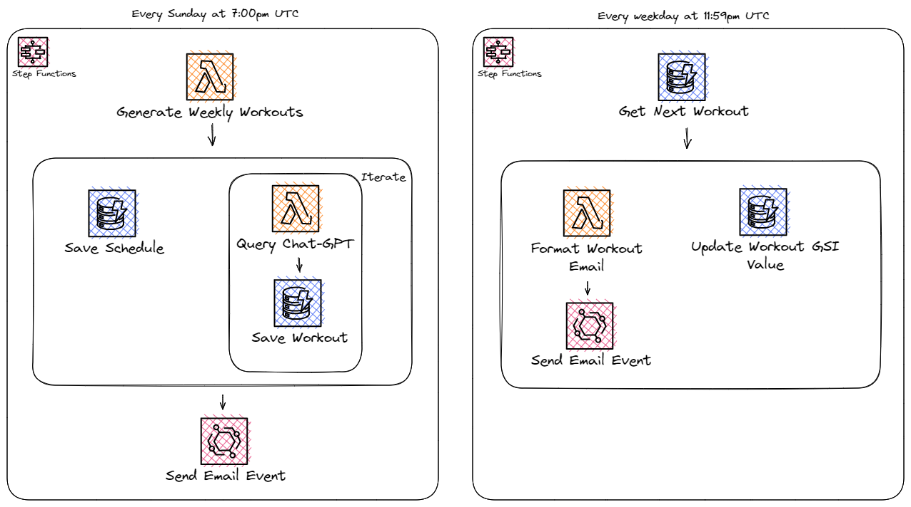

# Serverless AI Fitness

Would you like to say your workouts are created by AI? Cool, me too! And now we can!

Using the OpenAI API, this solution will query ChatGPT to build workouts for you that use equipment you have at your disposal.

For more details, please refer [to this blog post](https://readysetcloud.io/blog/allen.helton/chatgpt-is-my-new-personal-trainer).

## How It Works

This solution is powered by two Step Functions:

1. **Generate Weekly Schedule** - Randomizes which muscle groups, workout types, and equipment will be on each day and gets the workout from ChatGPT
2. **Daily Workout Notifier** - Sends an email in the evening with the workout details for the next day



## Deployment

This is a complete solution with both a user interface and back-end service. To deploy the entire application, you can hook up the repository to an Amplify build. However if you'd rather only deploy the service, you can do so with the following commands:

```
cd back-end
sam build
sam deploy --guided
```

### Deployment Variables

To successfully deploy the solution, you must provide the following deployment variables

* **TableName** - Name of the table in DynamoDB, defaults to *ai-fitness*
* **OpenAIApiKey** - API Key used to interact with ChatGPT. [More on this here](https://platform.openai.com/account/api-keys)
* **MomentoAuthToken** - Auth token used to cache ChatGPT responses. [Generate your token](https://docs.momentohq.com/getting-started#obtain-an-auth-token)
* **ContactEmail** - The email address you wish to send workouts to

*NOTE - This solution relies on the email configuration [from this repo](https://github.com/allenheltondev/serverless-newsletter-app) to send emails. The stack from that repo must be deployed for emails to be sent. An alternative would be to copy the [SendEmailFunction](https://github.com/allenheltondev/serverless-newsletter-app/blob/main/template.yaml#L171) from that repo into this one.*

### Configuring

You can configure several aspects of this application.

* [Muscle groups, workout types, and available equipment](./functions/generate-weekly-schedule/index.js)
* [When weekly workouts are generated](./template.yaml) (*see the `schedule` trigger on `BuildWeeklyWorkoutsStateMachine`*)
* [When daily email reminders are sent](./template.yaml) (*see the `schedule` trigger on `SendWorkoutEmailStateMachine`*)

## Cost

For the most part, this solution is free. It falls under the free tier for the AWS infrastructure, Momento cache, and SendGrid email allowance. However, this will cost a few cents per month in OpenAI. 